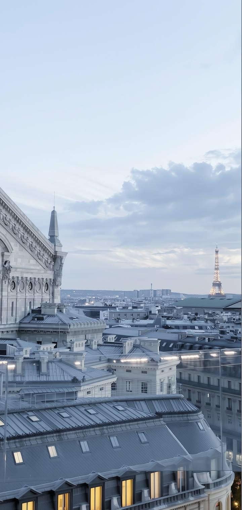
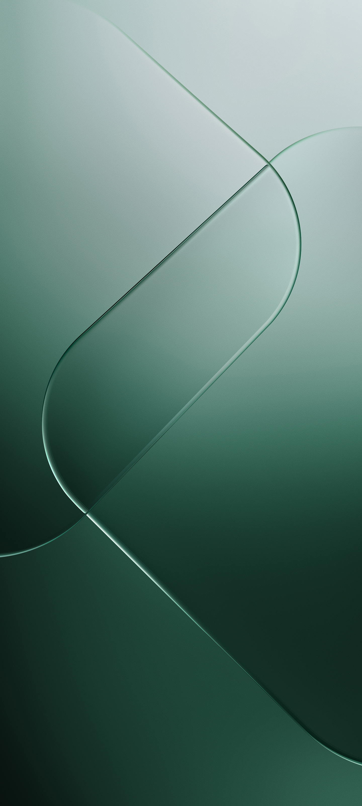

# 🖼️ My Collection of Wallpapers

Welcome to my personal corner of the internet! This is a curated collection of my favorite wallpapers gathered from all over the web. I built this repository so I can easily browse, sync, and download high-quality backgrounds onto any of my devices whenever I want a fresh aesthetic.

👉 **[Click here to view my live wallpaper gallery!](https://usrbinsrc.github.io/wallpapers/)**

---

## 🚫 No AI
This collection is strictly dedicated to **real, human-made artwork and photography**. 
* **Zero AI-generated images** belong in this collection. 
* If an AI image ever slips in, it was an honest mistake because it tricked my radar. Please let me know if you spot one!

---

## 📂 Repository Structure

The wallpapers are organized into two main folders depending on your device's screen aspect ratio:

* 💻 **`images/desktop/`** — Wide, high-resolution wallpapers tailored for monitors, laptops, and tablets.
* 📱 **`images/mobile/`** — Vertical, crisp wallpapers perfect for smartphone lockscreens and homescreens.

---

## ✨ Automated Optimization

To keep the gallery loading incredibly fast on all devices, this repository uses a custom **GitHub Action** pipeline. Every time an image is added or changed:
* **JPEGs** are optimized down to 85% quality.
* **PNGs** are compressed aggressively using `pngquant`.
* **WebPs** are automatically compressed in-place.
* A live **`wallpapers.json`** list is generated to power the web gallery instantly.

---

## 👀 Previews

<table>
  <tr>
    <td valign="top" width="50%">
      <strong>💻 Desktop Previews</strong>  
        
      
    </td>
    <td valign="top" width="50%">
      <strong>📱 Mobile Previews</strong>  
      
      
      
    </td>
  </tr>
</table>

---

*Curated purely for personal use and aesthetics.*
